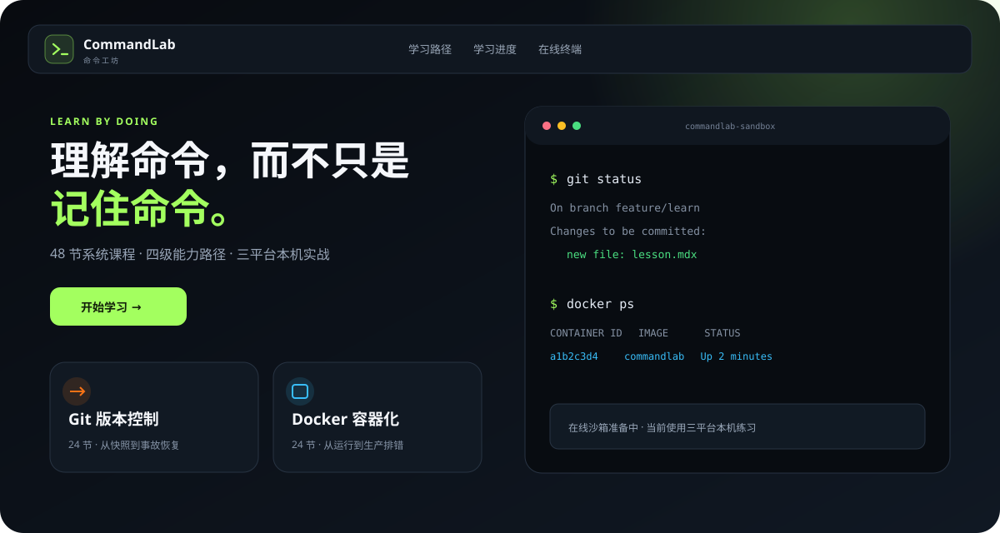

# 命令工坊 CommandLab

[](https://github.com/RUOLINGDADA/commandlab/actions/workflows/ci.yml)
[](https://ruolingdada.github.io/commandlab/)
[](LICENSE)
[](content/LICENSE)

面向初学者的中文开发工具实战平台。CommandLab 不只罗列命令，还会解释思维模型、常见坑点、相似命令差异，并提供 Windows、macOS、Linux 三平台本机练习。

**在线体验：** <https://ruolingdada.github.io/commandlab/>



## 首发内容

- Git 24 节：从工作区、暂存区和提交，到协作、历史整理与事故恢复。
- Docker 24 节：从镜像和容器，到构建、Compose、安全与生产排错。
- 每节课包含互动题、坑点、命令辨析、衍生练习、验证与安全清理。
- 完成状态、收藏和笔记保存在浏览器 IndexedDB，无需注册。
- 在线终端暂未开放；专业隔离服务器准备好后再加入真实沙箱。

## Docker 一键部署

需要 Docker Desktop 或 Docker Engine + Compose。项目会先构建 Next.js 静态站点，再交给 Nginx 提供服务：

```bash
docker compose up -d --build
```

浏览器打开 <http://localhost:8080>。停止服务：

```bash
docker compose down
```

修改端口时设置 `COMMANDLAB_PORT`，例如 `COMMANDLAB_PORT=9000 docker compose up -d --build`。

## 本地开发

要求 Node.js 24 或更高版本、pnpm 11.19.0。

```bash
corepack enable
pnpm install --frozen-lockfile
pnpm dev
```

浏览器打开 <http://localhost:3000>。

## 验证与构建

```bash
pnpm format:check
pnpm lint
pnpm typecheck
pnpm test
pnpm validate:content
pnpm build
```

模拟 GitHub Pages 的 `/commandlab` 子路径：

```bash
GITHUB_PAGES=true GITHUB_REPOSITORY=RUOLINGDADA/commandlab pnpm build
pnpm --filter @commandlab/web validate:export
```

PowerShell 可使用：

```powershell
$env:GITHUB_PAGES='true'
$env:GITHUB_REPOSITORY='RUOLINGDADA/commandlab'
pnpm build
pnpm --filter @commandlab/web validate:export
```

## 添加或改进课程

课程位于 `content/git` 与 `content/docker`，使用带 YAML frontmatter 的 MDX。新增内容必须通过共享 Zod Schema、课程数量、顺序、前置关系和三平台指引校验。

提交前请阅读 [贡献指南](CONTRIBUTING.md)。项目内 Agent 还必须遵循 [CommandLab 项目工作流](.agents/skills/commandlab-project-workflow/SKILL.md)。

## 发布

维护者在 GitHub 的 **Actions → Create release** 中输入语义化版本。工作流创建 GitHub Release 后，Pages 工作流会自动构建并部署网站。当前版本为 `v0.2.0`。

## 许可

- 源代码： [MIT](LICENSE)
- `content/` 下课程与练习： [CC BY-NC-SA 4.0](content/LICENSE)

详细边界见 [NOTICE](NOTICE.md)。
